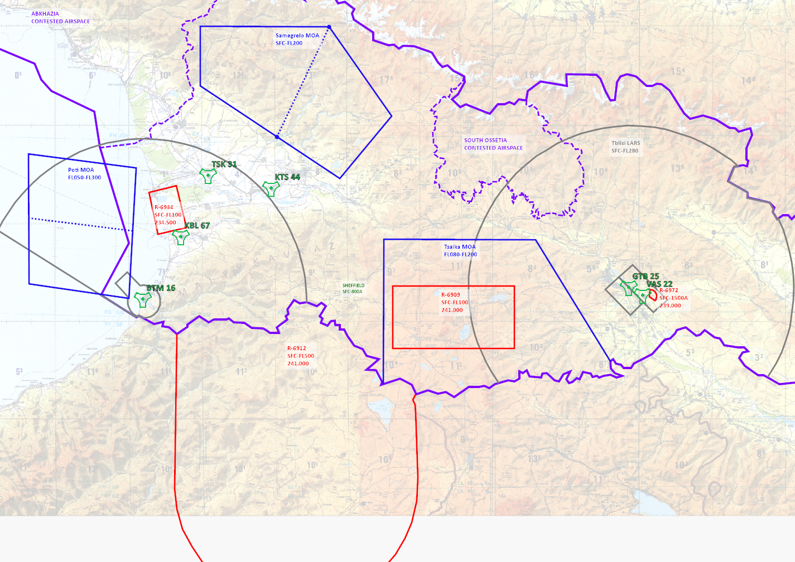
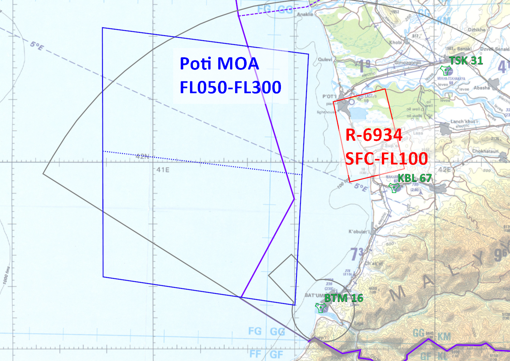
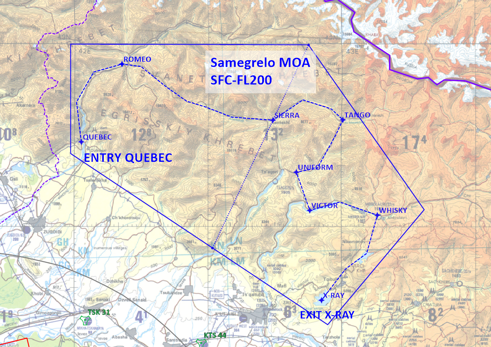
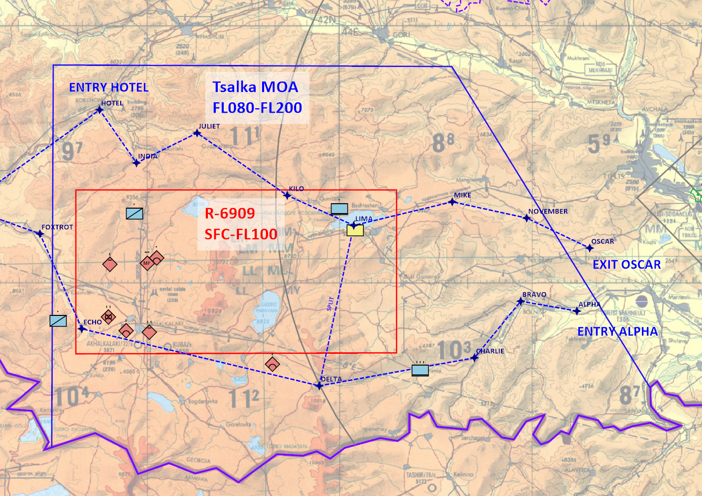
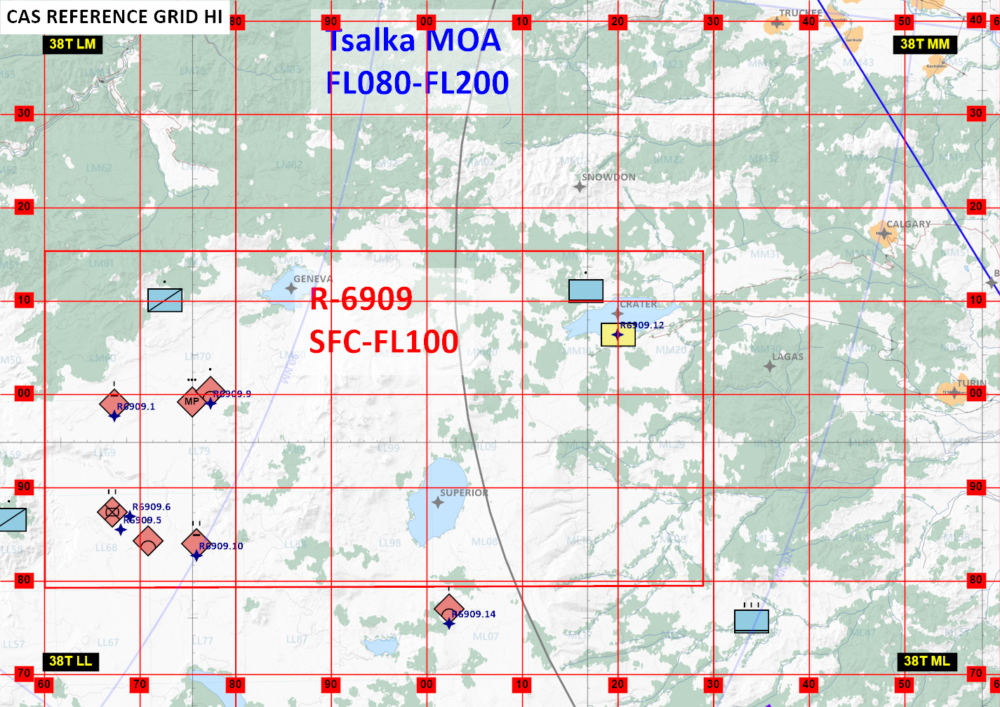
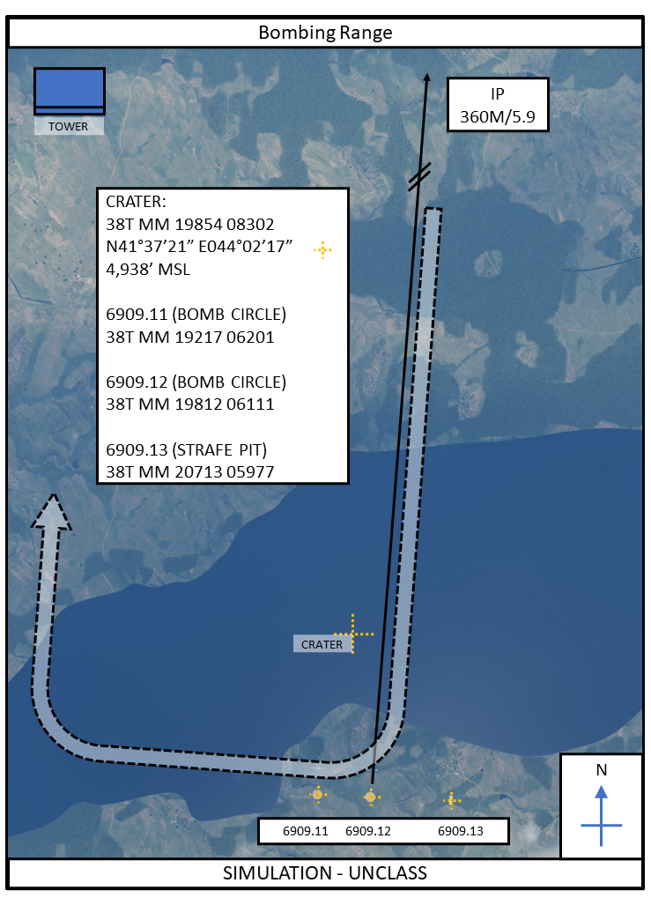

20230414-RAMPART_Range_Brief-U

14 Apr 23

# RAMPART Range Brief

## Introduction

Operation RAMPART is a multinational expeditionary presence in the Black Sea region to strengthen Georgian defence and project western coalition force in the face of destabilising influences.

To maintain warfighter competency and currency in essential skills, several Military Operating Areas (MOAs) and ranges have been identified with agreement with the host nation as suitable for military training and exercises.

## Designations

A MOA is airspace established outside of Class A airspace to separate or segregate certain non-hazardous military flight activities from IFR aircraft and to identify for VFR aircraft where these activities are conducted.
It is possible, indeed likely, that civil traffic may pass through a MOA en-route.
It is the military pilot's responsibility to ensure these areas are clear and safe before conducting any activity that may be hazardous to other traffic.
Flight following and basic radar services may be available from the nearest ground radar station to assist situational awareness.

Restricted areas are where operations are hazardous to any flying in the vicinity
Restricted areas denote the existence of unusual hazards that are often not immediately visible (for example, artillery firing, aerial gunnery, or guided missiles).
No civil traffic may enter a restricted area while it is hot.
It is the pilots responsibility to book restricted areas for military activity to ensure other traffic is vectored clear.

## Area Overview

The figure below highlights the entire RAMPART Area of Operations.
The Georgian ADIZ is highlighted in purple with the contested border areas shown.
MOAs are blue and restricted areas are red.
Each area is labeled with appropriate altitude blocks given.

## MOAs

### Poti MOA

#### Purpose and Usage

Poti MOA is an area measuring approximately 40nm by 34nm off-shore of the Poti lake area.
This range is used exclusively for Basic Fighter Maneuvers (BFM) and Beyond Visual Range (BVR) engagements.
Live weapons may be used within the range confines against target aircraft but the responsibility remains with the user to ensure that no other aircraft are at any risk of collateral damage.
Users are also advised that any target aircraft launched in the range are always clear of any other aircraft to avoid undesired effects.

#### Boundaries

The MOA is split into a north and south segment which is defined by the 270 radial of the KBL TACAN (67X).
The bounding coordinates are detailed in the table below.

| Point   | Coordinates            |
| ------- | ---------------------- |
| Point 1 | N41 37.159 E041 30.455 |
| Point 2 | N41 41.637 E040 49.359 |
| Point 3 | N42 21.354 E040 49.176 |
| Point 4 | N42 17.182 E041 33.424 |

The Poti MOA starts at FL050 and ends at FL300.

#### Control

Poti MOA will be generally controlled with Batumi Radar.
If active, control may be delegated to a nominated range control or airborne surveillance asset.

### Samegrelo MOA

#### Purpose and Usage

Samegrelo MOA is used exclusively for low-level fighter training and navigation.
The MOA's primary purpose is to encapsulate the Kessel Run low-level route.
Due to the proximity of the Kessel Run entry and the edge of the Samegrelo MOA to contested borders, no pilots may use this range without first obtaining permission from their Squadron CO and only then may they fly the route after they have received a familiarisation flight of the segments from QUEBEC to SIERRA.

#### Boundaries

The MOA is split into a east and west segment which is defined by the 199 radial of Point 3 of the boundary.
The bounding coordinates are detailed in the table below.

| Point   | Coordinates            |
| ------- | ---------------------- |
| Point 1 | N42 42.039 E041 59.609 |
| Point 2 | N42 59.900 E041 59.609 |
| Point 3 | N42 59.783 E042 52.633 |
| Point 4 | N42 32.783 E043 18.428 |
| Point 5 | N42 13.848 E042 56.932 |

The Samegrelo MOA starts at the surface and ends at FL200.

#### Control

Samegrelo MOA will be generally controlled with Batumi Radar.
If active, control may be delegated to a nominated range control or airborne surveillance asset.

### Tsalka MOA

#### Purpose and Usage

Tsalka MOA is a complex area activity that abuts the souther Georgian border.
The area contains restricted areas, frequent helicopter movements, and a low-level route.
The two low-level entries are designated as ALPHA to the east and HOTEL on the northwest and the exit is at point OSCAR.

#### Boundaries

The MOA extends north from the southern border to the points below.

| Point   | Coordinates            |
| ------- | ---------------------- |
| Point 1 | N41 10.768 E043 15.029 |
| Point 2 | N41 55.411 E043 15.244 |
| Point 3 | N41 55.245 E044 17.429 |
| Point 4 | N41 17.837 E044 48.301 |

The Tsalka MOA starts at the FL080 and ends at FL200.

#### Control

Tsalka MOA will be generally controlled with Tbilisi Radar.
If active, control may be delegated to a nominated range control or airborne surveillance asset.

## Control Points (CPs)

Several pre-determined CPs have been established in the R-6909 range to aid coordination for CAS and strike exercises.
An overview of these points is shown in the figure below, but note that the pilot kneeboards will be the kept up to date with all positions.

## Bombing Circles and Strafe Pit

In the NW section of R-6909 at CP "CRATER" are two bombing circles and one strafe pit as shown in the figure below.
This range is cleared for live ordnance while using RH patterns in from the north to the south on ingress.
A white ISO container has been positioned 5.9nm north in a clearing to indicate the IP.
Note that low-level flights may use the range for live ordnance delivery from ingress headings other than south, but these situations will be briefed in range bookings.

