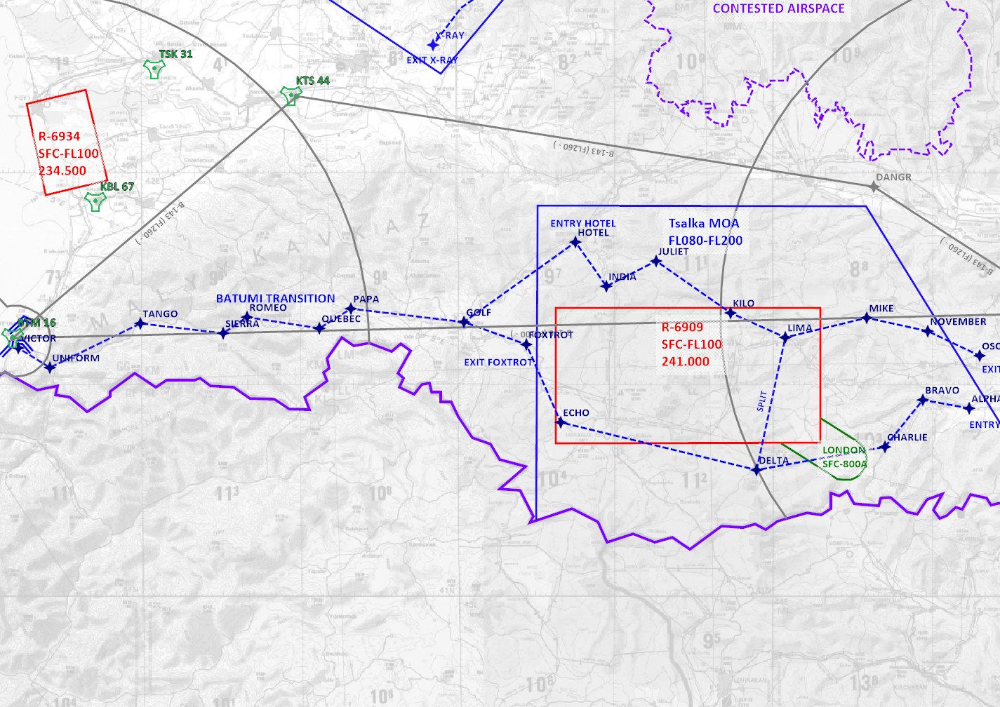

20230421-Trench_Run_Brief-U

21 Apr 23

Distribution:

UKFOR JEF Aircrew and Officers

# Trench Run Brief

## Introduction

**WARNING:** This route will pass through active ranges and Forward Air Refuelling Positions, all pilots must plan and deconflict prior to entry.

The Trench Run is a low-level navigation route that has been designed for training and currency of fast-jet pilots in the Joint Expeditionary Force (JEF).
There are several variations of this route that can be used depending on the requirements of the user.
Most of the route is directional, i.e. one-way traffic, but certain transitions and crossings may be used in either direction.
Due to the two-way nature of some sections of this route, all users SHALL book the elements of the route they plan on using with Headquarters Operations Staff.
The entire route is shown below for reference, but users SHALL refer to the master [CombatFlite Template](../Mission_Planning/Master_RAMPART_Overview.cf) for current information.

The main configurations that may be flown are as follows:

1. Main Loop
2. East Split
3. West Split
4. Batumi Transition

The route can be joined or exited from the following locations:

1. Entry ALPHA
2. Exit FOXTROT
3. Entry HOTEL
4. Exit OSCAR
5. Entry/Exit VICTOR

The sections below will go into more detail of each variation of the route.

### Main Loop

This is the primary, and assumed, usage of the Trench Run route.
Users will descent to 250' AGL or below at Entry ALPHA and proceed west in a clockwise direction through GOLF then back east towards exit OSCAR.
At OSCAR, pilots will either continue VFR navigation, or climb and pick up IFR clearance to their next destination.

### East Split

The East Split variation is entered in the same manner as the Main Loop and continues to point DELTA split where the pilot will turn right, northbound to pick up point LIMA, and then right again to exit at OSCAR, per the Main Loop procedure.

This split allows use of the CRATER bombing range by joining either on a right downwind (northbound) leg, or direct in from the south.
All users SHALL book the CRATER range and communicate their intentions clearly to Range Control to avoid other traffic.

### West Split

The West Split is joined from entry HOTEL and continues immediately to the east towards the LIMA split.
At the LIMA split, pilots may utilise CRATER range, but must continue south to continue clockwise towards DELTA and then exit FOXTROT.

### Batumi Transition

The Batumi Transition is a two-way route running east-west and west-east.
Pilots may use the transition to exit the main route or west split at GOLF and then continue to VICTOR.

Prior to exiting at VICTOR, pilots will ensure Batumi tower is aware of their arrival by booking ahead with an ETA, or by relaying over VHF via other aircraft.

The second option for this route is to entry at VICTOR, again by communicating with Batumi Tower, then continuing east to GOLF, then picking up either the Main Loop or West Split.
