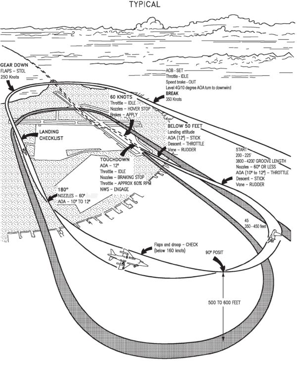
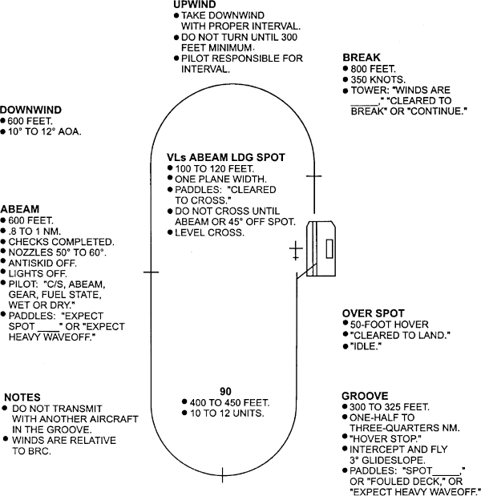
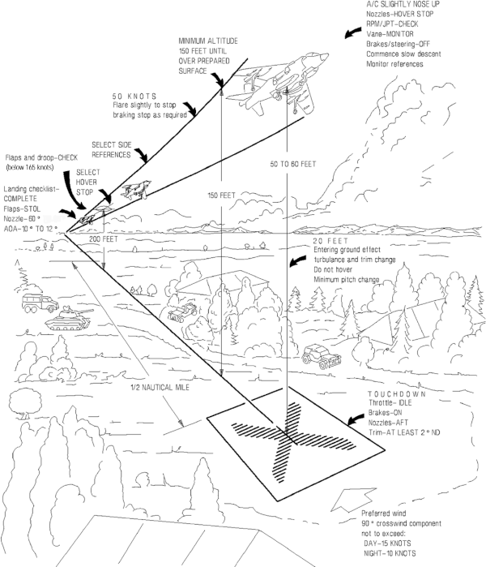

20230414-801NAS_SOPs-R

14 Apr 23

Distribution:

JEF HQ Staff
JEF Squadron COs and Executives
801NAS Aircrew and Officers

# Standard Operating Procedures for 801 NAS

## Introduction

801 NAS is deployed as an element of the Joint Expeditionary Force for Op RAMPART in the Georgian area.
The squadron will be based out of the Tbilisi-Lochini (UGTB) airfield for the short-term until such time the squadron may need to move to an unimproved site.

While at UGTB, we are expected to integrate with, and operate alongside, a large number of different aircraft types and nationalities.
Squadron pilots will need to maintain good situational awareness in the airfield vicinity to operate safely.

Where possible aircraft movements should be conducted as flights to reduce workload on controllers and other pilots.

Copies of charts included in this document are for reference only.
Refer to you pre-prepared kneeboards for the latest information.

## Airfield Procedures

### Takeoff

### Departures

Flight from UGTB should be done either under VFR departure rules or by following an approved IFR departure plate.
In most cases, if departing to the Tsalka MOA and R6909 range, use of the LAGAS ONE(1) departure will be preferred.
For all other departures to the west, it's likely that the MUKHRANI TWO(2) departure to join the B-143 airway will be preferred.

If departing under VFR conditions, be cautious of rotary traffic departing to the north and to the west.
Standard rotary low-level routes have been assigned for helicopters as shown below.

### Approaches

A series of IFR approach charts are available for use in the pilot kneeboards.
If in IFR conditions, pilots will need to use either the ILS or TACAN approaches to a full stop, or, only if specifically cleared by ATC, may request to cancel IFR when below base and back in VFR conditions.

For pilots who are less comfortable with IFR approaches, you may request vectors to VFR conditions for a visual recovery.

### Landing

By default, 801 NAS pilots will follow the procedure for a Fixed Nozzle Slow Landing (FNSL) if arriving on the main runway at UGTB.
All patterns will be joined at 800' AGL and 350s as normal.
The detailed procedure for a FNSL is found at A1-AV8BB-NFM-000, section 7.6.5.1.1., however a quick reference image is below as an aide-memoire.

## Field Carrier Landing Practice (FCLP)

To assist with the maintenance of currency and competency of the low-speed STOVL handling characteristics of the Harrier, a FCLP site (also referred to as the "Ski-Ramp" or simply "Ramp") has been built on taxiway November of UGTB.
The Ski-Ramp may be used at any time by 801NAS pilots as an alternate means of takeoff or landing at UGTB subject to ATC clearance.

The procedure for the Ski-Ramp will always be in accordance with NAVAIR 00-80T-111.
An extract of the relevant day pattern procedure is included below for reference.

## Austere Strips

801NAS pilots are approved to conduct Vertical Landings (VLs) and Short Takeoffs (STOs) from predefined austere strips or from taxiway November at UGTB.
The procedures to be followed in these conditions are found in A1-AV8BB-NFM-000.
When operating at density altitudes above sea level, it is imperative that the max dry and max wet takeoff and landing weights are calculated as applicable and not exceeded at any time.
A reference graphic for the approach to a VL is shown below.

