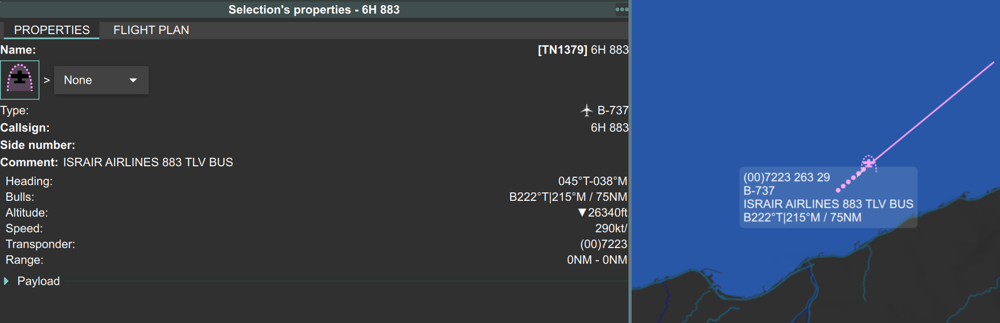
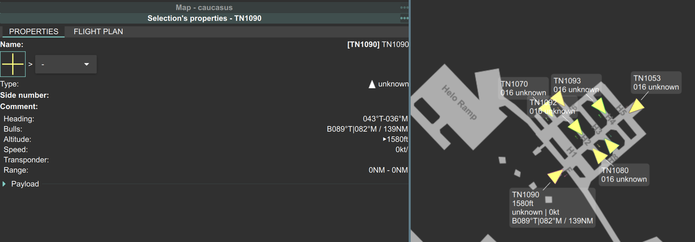
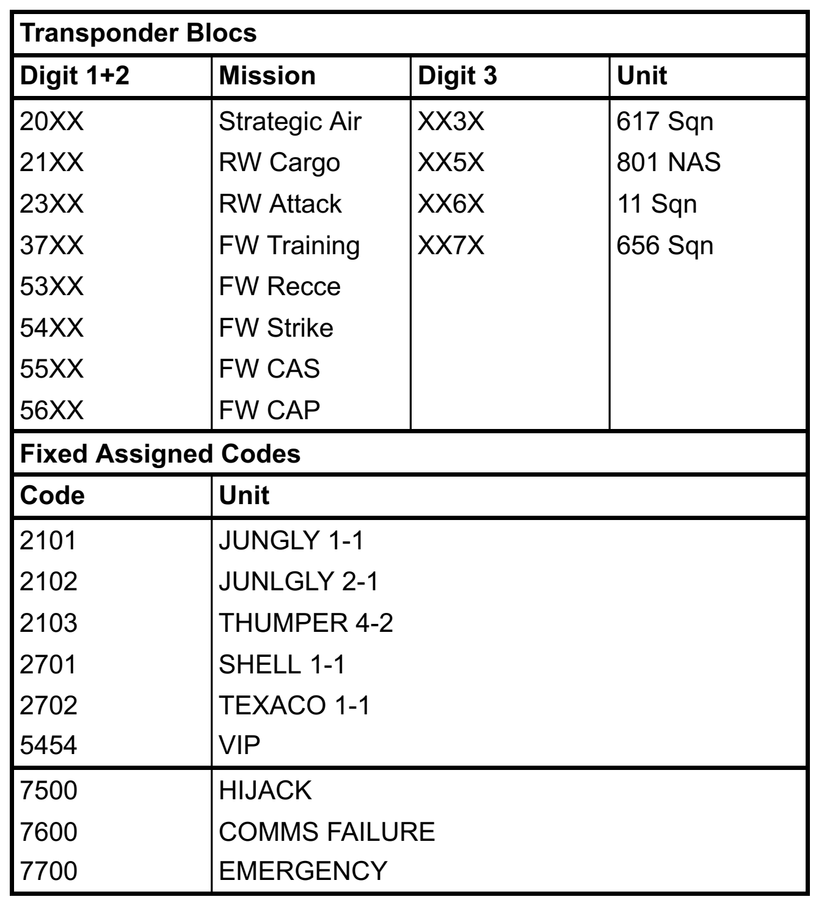
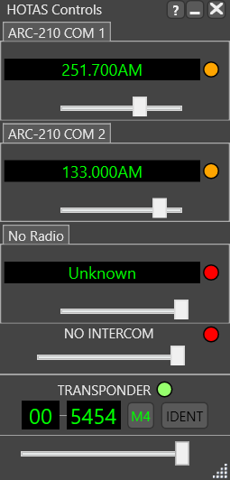
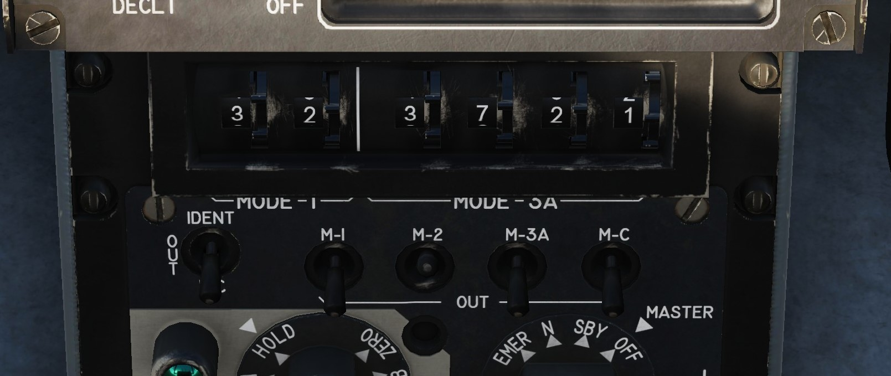
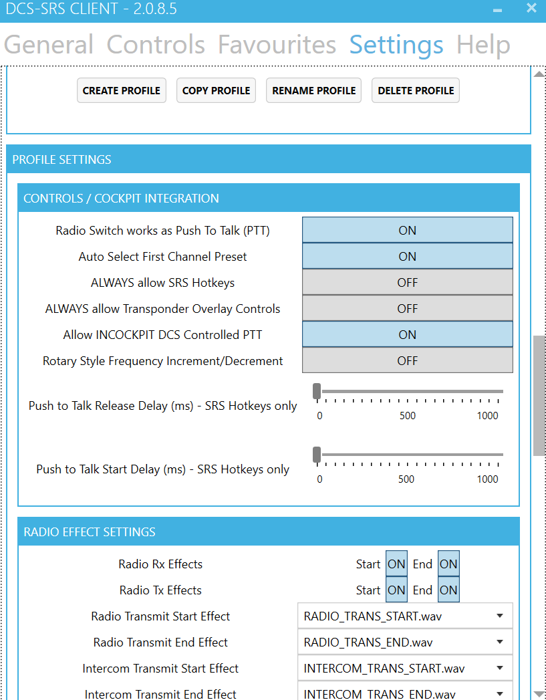

20230421-Transponder_Settings-U

21 Apr 23

Distribution:

UKFOR JEF Aircrew and Officers

# Setting Transponders for LotATC Integration

## Introduction

Op RAMPART is setup to provide a realistic insight into combined civil and military aviation in a complex airspace environment.
When controllers assist JEF pilots using LotATC, they will only see primary radar returns and transponder codes for each aircraft on the server.
Some aircraft, such as airliners and tankers, who are flying on IFR flight plans, have been pre-assigned a transponder code and the LotATC server is kept up to date with the details of each flight plan.
For example, Israir 833 is operating under the flight number 6H 883 from Tel Aviv to Batumi.
It has been pre-assigned the transponder code 7223 which is reflected on the server, therefore LotATC recognises the code and populates the details as shown below:

If an aircraft is flying with no communication with ATC and no pre-assigned squawk code, it will be shown as an "unknown" contact and may require interception by CAP or QRA.
An example of such a contact is can be seen below

## Reserved Codes

Some full and partial transponder codes have been pre-assigned and are shown on the pilot kneeboards.
An example is shown below, but for each mission, refer to your kneeboards.

If there are no controllers on for a given mission, it is good practice to select a transponder code based on your mission and unit.
For example, if a flight of two Harriers are conducting a strike mission, they may select codes 5454 and 5355, and a single-ship Hawk aircraft on a navigation exercise may squawk 3701.

## SRS Overlay

Even if a DCS aircraft does not have an implemented transponder system, all SRS users can manually set a transponder code using the Radio overlay feature.
Ensure that SRS has the "ALWAYS allow Transponder Overlay Controls" value set to "ON."
Enable the overlay and click the round butto to the right of the word "TRANSPONDER" on the lower section of the overlay, this should turn the button green.
Next, in the second box, enter the four-digit transponder code assigned, and click the "M4" button to the right so that it is highlighted green.

## Aircraft-Specific Transponder Interfaces

### Mirage 2000C

The Mirage aircraft has a transponder panel in front of the stick and below the VTB.
Using the rotating selector knobs, set right 4 digits to the code specified and ensure that the mode switches for at least M-3A and M-3C are in the down, "OUT," position.
If required, use the two-digits on the left to input the mode 1 code and ensure the M-1 switch is also in the down position.

To the left of the mode switches, place this in the up, "IDENT," position if requested to do so by ATC, then once identified, put the switch into the center position again.

To ensure the in-cockpit transponder selections work, check and ensure that SRS has the "ALWAYS allow Transponder Overlay Controls" value set to "OFF."

