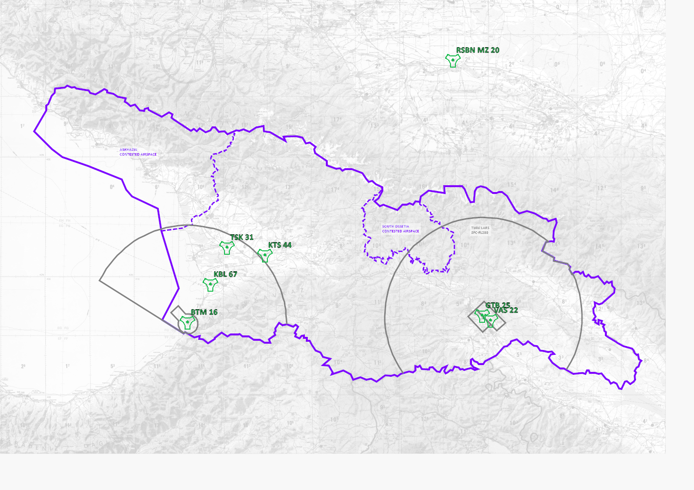
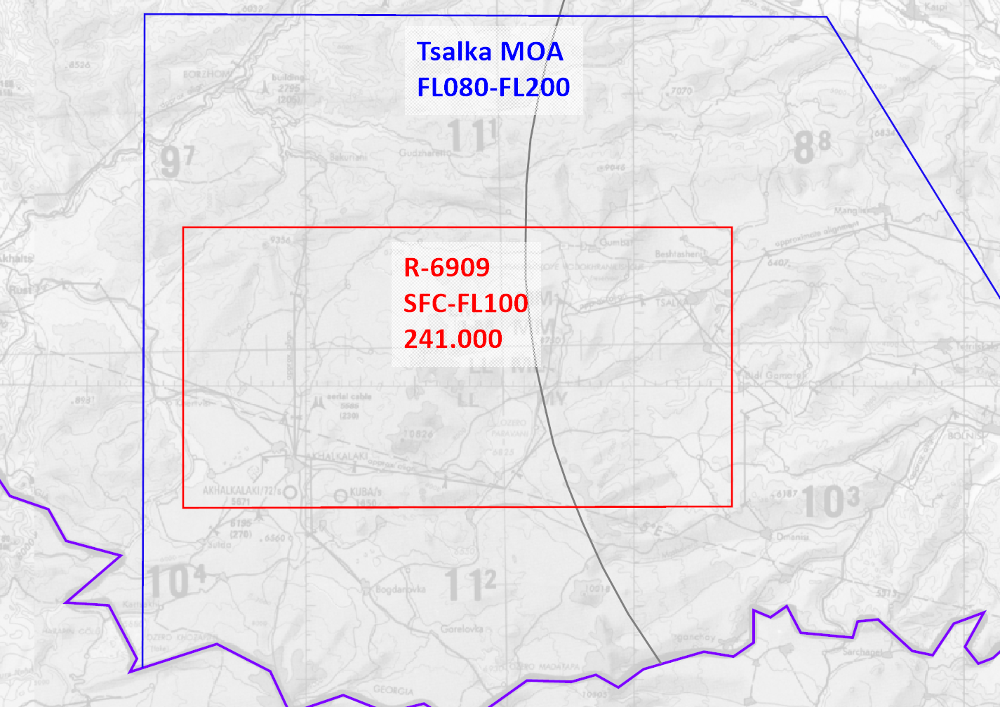

20230421-RAMPART_Airspace_Brief-U

21 Apr 23

Distribution:

UKFOR JEF Aircrew and Officers

# Airspace Brief

**WARNING:** This brief is for entertainment purposes only and is not to be used for any form of aviation training or planning.

This document is for familiarisation and training of Joint Strike Wing aircrew operating in the RAMPART area of operations.
Refer to the latest published [CombatFlite template](../Mission_Planning/Master_RAMPART_Overview.cf) for current airspace information for navigation and planning.

## Airspace Types

### Lower Airspace Radar Service (LARS)

- From SFC to FL280, radar coverage permitting
- 50nm radius
- Indicated as grey lines on kneeboards and charts
- Two stations:
  - Kobuleti Approach
  - Batumi Approach
- Provide radar services to all aircraft
- Will advise on MOA and ROMEO activity
- Give approach clearance
- Hand-off to aerodromes

### Air Defence Identification Zone (ADIZ)

- Represented by the border of the host country
- Extends 12nm offshore at maritime border
- Indicated as purple lines on kneeboards and charts
  - Contested airspace may be marked with dashed lines
- Need clearance to enter an ADIZ if you departed from outside that ADIZ
- Generally monitored by adjacent LARS
- Could also be monitored by other maritime, land, or airborne early warning systems

### Aerodromes

- Controlled airspace around airfields
- Could be bound:
  - within 5nm radius of the runway center, or
  - specific shape to account for adjacent fields, and
  - from SFC to approx. 1,500’ AGL
- Indicated as grey lines on kneeboards and charts
- Some fields (Batumi) may have an extension up to 10nm along runway centerline for radar approaches
- Controlled on Tower frequencies
- One tower may control multiple fields (e.g. Tbilisi includes Vasiani)

### Military Operating Areas (MOAs)

- Areas where high volumes of military activity may occur
- Civil traffic may transit
- Indicated in blue with:
  - MOA name
  - Upper-lower altitudes
- Controlling agency will normally be nearest LARS
- Possibly controlled temporarily by other maritime, land, or airborne early warning systems

### Restricted Airspace (ROMEOs)

- Areas where high volumes of military activity may occur
- May contain live fire ranges
- Civil traffic may not transit if active
- Indicated in red with:
  - R-number
  - Upper-lower altitudes
  - Controlling frequency
- Controlling agency will normally be nearest LARS
- Possibly controlled temporarily by other maritime, land, or airborne early warning systems

### Forward Arming and Refueling Points (FARPs)

- High volumes of military activity
- Low-altitude operations
- Generally uncontrolled, but may have a Mobile Air Operations Team (MOAT)
- Identified as green areas with FARP name and altitude range
- Low-flying fast jet routes may cross through or near at 50 to 250’ AGL.
- Fast jet pilots:
  - responsible for avoidance
  - announce intent on RW frequencies where possible
  - be cautious of wake turbulence

### Close Air Support (CAS) Zones and Control Points (CPs)

- Used to reference air and ground assets for close air support tasking
- CPs look similar to fixes with GREY points and names
- Identified as grey points
- Names may reference familiar place names based on local geography

## Routes

### Airways

- Pre-determined high altitude routes between radio navigation aids
- Identified as grey lines
- Will usually be joined and exited from IFR departure and approach procedures

### Low-Level Routes

- Predefined Training Routes
- Operated at or below 250’ AGL
- Designated Entry and Exits
- Identified as blue dashed lines
- Waypoints Sequential Alphabetically
- Controlled Directions
- Variations include:
  - Crossing Points
  - Transition Routes
- Normally in MOAs
- Separate briefing packs available for each route

### Helicopter Approach and Departure Routes

- Predefined Routes To and From Aerodromes
- Operated at or Below 250’ AGL
- Designated Entry and Exits
- Used to Deconflict FW Traffic
- Traffic Uses RH of Corridor

### Fixes and Intersections

- Used as reference points for IFR:
  - approaches,
  - departures,
  - and navigation
- Fixes shown in grey with 5-letter name
  - Maybe GPS referenced, but normally given as range and bearing to a nearby TACAN or other radio beacon
- Intersections same, but in purple
  - Normally identified as the point of intersection of two different TACAN or other radio beacon radials

